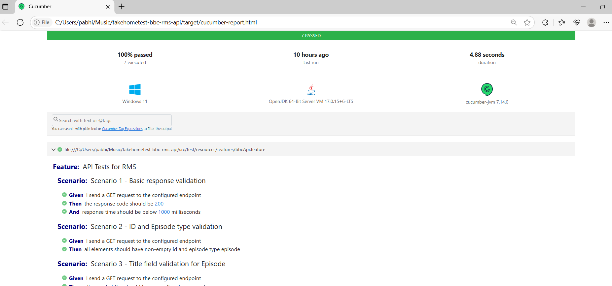
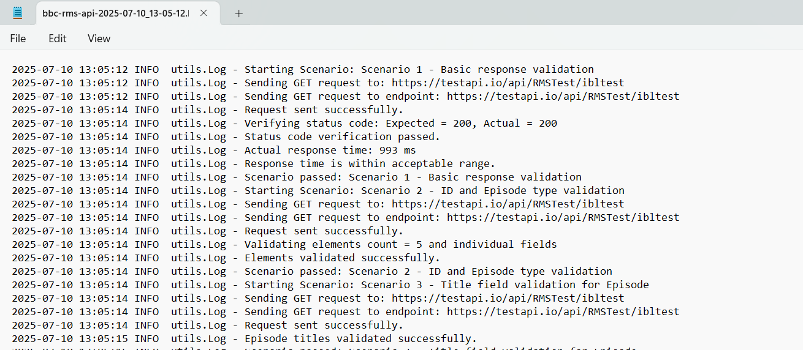

# Take-home Test for BBC RMS API Automation Framework

This is a Cucumber + Java + Rest Assured automation framework for testing the RMS API endpoint provided in the BBC SDET take-home task.

---

## Tech Stack

| Tool            | Purpose                              |
|-----------------|---------------------------------------|
| Java            | Programming language                  |
| Cucumber        | BDD-style testing (Feature files)     |
| Rest Assured    | API testing library                   |
| JUnit           | Test runner                           |
| Maven           | Dependency & project management       |
| SLF4J           | Logging utility                       |

---

## Scenarios Covered

1. Status code is 200 and response time is under 1000ms  
2. All elements have non-null IDs and type = "episode"  
3. Title in each episode is not null or empty  
4. Only one episode has `live = true`  
5. `transmission_start` is before `transmission_end`  
6. `Date` header is present in the response  
7. For an invalid date, API returns 404 with error details

---

## Project Structure

```
takehometest-bbc-rms-api/
│
├── pom.xml
│
└── src/
    ├── main/
    │   ├── java/
    │   │   └── utils/
    │   │       ├── Config.java
    │   │       ├── Log.java
    │   │       
    │   └── resources/
    │       ├── config.properties
    │       └── logback.xml
    │
    └── test/
        ├── java/
        │   ├── helperutil/
        │   │   └── BBCApiHelper.java
        │   │
        │   ├── hooks/
        │   │   └── TestHooks.java
        │   │
        │   ├── model/
        │   │   └── Element.java
        │   │   └── Episode.java
        │   │   └── Root.java
        │   │   └── Schedule.java                      
        │   │
        │   ├── runner/
        │   │   └── TestRunner.java
        │   │
        │   ├── steps/
        │       └── BBCApiSteps.java
        │         │
        └── resources/
            └── features/
                └── bbcApi.feature
                └── bbcManualTests.feature
```
---

## How to Run the Tests

### Prerequisites

- Java JDK 8+
- Maven 3.6+
- IDE like IntelliJ IDEA or Eclipse

### Steps to run the project on Windows or macOS.

#### 1. Clone the Repository
Prerequisite: Install Git on your system.

- Windows:
    - Open Command Prompt or Git Bash
    - Run the following commands:
    - git clone https://github.com/<your-username>/takehometest-bbc-rms-api.git
    - cd takehometest-bbc-rms-api

- macOS:
    - Open Terminal
    - Run the same commands as above.

  Note: Replace <your-username> with actual GitHub username.

#### 2. Open the Project in IntelliJ IDEA (or Eclipse)
  Steps (Windows/macOS):
   - Open IntelliJ IDEA
   - Go to File > Open
   - Navigate to your project directory:

  Windows: C:\Users\<YourName>\takehometest-bbc-rms-api
  macOS: /Users/<YourName>/takehometest-bbc-rms-api

  Note: IntelliJ will detect it's a Maven project and load dependencies.

#### 3. Install Maven (if not already installed)
- Windows:
    Download Apache Maven
    Extract it to: C:\Program Files\Apache\Maven

    Set environment variables:
    MAVEN_HOME: C:\Program Files\Apache\Maven
    Add %MAVEN_HOME%\bin to the Path variable.

    To verify:
    ```
    bash
    mvn -v
    ```

- macOS:
  Install via Homebrew:
    ```
    bash
    brew install maven
    ```
 
#### 4. Install Project Dependencies
  From the terminal (in project root directory):
  
  ```
  bash
  mvn clean install
  ```
  This will:
    Download all Maven dependencies
    Compile the source code
    Run unit and Cucumber tests

#### 5. Run the Tests
  Run all feature files with:
  ```
  bash
  mvn clean test
  ```
  Note: We can also right-click on TestRunner.java inside runner package and choose Run from IntelliJ.

#### 6. View the Test Report
  After test execution, open the report at:
  ```
  bash
  target/cucumber-reports.html
  ```
  Note :Right-click and Open With Browser or drag it into a browser window.

  Example: 
  

#### 7. Logging Setup
  Ensure the logback.xml is inside src/main/resources. 
  The log file will be generated at:
    Windows: .\logs\bbc-rms-api-${RUN_TIMESTAMP}.log
    macOS: ./logs/bbc-rms-api-${RUN_TIMESTAMP}.log

  Example: 
  


## API Under Test
```
https://testapi.io/api/RMSTest/ibltest

```
## Author
- Submitted by ABHISHEK PETER